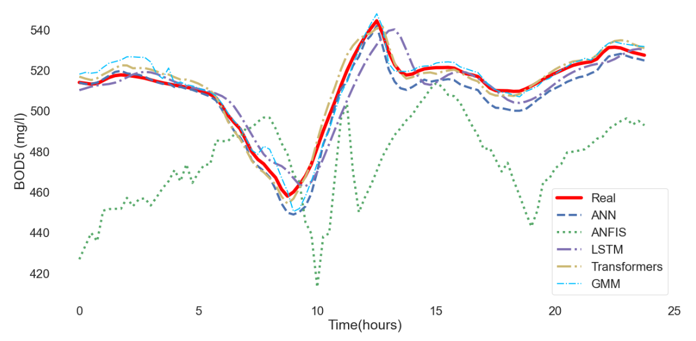

# Prediction of Key Variables in Wastewater Treatment Plants Using Machine Learning Models
> The objective of this work is to predict key variables in the wastewater treatment process, carried out in Wastewater Treatment Plants (WWTP).

## Table of Contents
* [General Info](#general-information)
* [Technologies Used](#technologies-used)
* [Screenshots](#screenshots)
* [Setup](#setup)
* [Usage](#usage)
* [Project Status](#project-status)
* [Room for Improvement](#room-for-improvement)
* [Acknowledgements](#acknowledgements)
* [Contact](#contact)
<!-- * [License](#license) -->

## General Information
* Programs to predict the following key variables for wastewater treatment:
  * Total suspended solids (TSS)
  * Ammonia and Ammonium
  * Nitrate and Nitrite
  * Biological Oxygen Demand (BOD5)
* Machine learning models used for predictions:
  * Artificial Neural Networks (ANN)
  * Long Short-Term Memory (LSTM)
  * Adaptive Neuro-Fuzzy Inference System (ANFIS)
  * Transformers
  * Gaussian Mixture Model (GMM)
<!-- You don't have to answer all the questions - just the ones relevant to your project. -->

## Technologies Used
- Python - version 3.8.8
- Keras - version 2.6.0
- TensorFlow - version 2.6.0

## Screenshots

<!-- If you have screenshots you'd like to share, include them here. -->

## Setup
What are the project requirements/dependencies? Where are they listed? A requirements.txt or a Pipfile.lock file perhaps? Where is it located?

Proceed to describe how to install / setup one's local environment / get started with the project.

## Usage
How does one go about using it?
Provide various use cases and code examples here.

`write-your-code-here`

## Project Status
Project is: _in progress_ / _complete_ / _no longer being worked on_. If you are no longer working on it, provide reasons why.

## Room for Improvement
Include areas you believe need improvement / could be improved. Also add TODOs for future development.

Room for improvement:
- Improvement to be done 1
- Improvement to be done 2

To do:
- Feature to be added 1
- Feature to be added 2

## Acknowledgements
Give credit here.
- This project was inspired by...
- This project was based on [this tutorial](https://www.example.com).
- Many thanks to...

## Contact
Created by [@flynerdpl](https://www.flynerd.pl/) - feel free to contact me!

<!-- Optional -->
<!-- ## License -->
<!-- This project is open source and available under the [... License](). -->

<!-- You don't have to include all sections - just the one's relevant to your project -->
