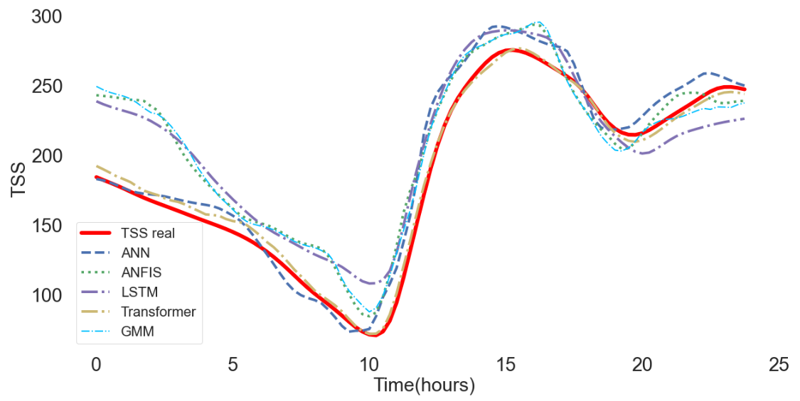

# Prediction of Key Variables in Wastewater Treatment Plants Using Machine Learning Models
> The objective of this work is to predict key variables in the wastewater treatment process, carried out in Wastewater Treatment Plants (WWTP).

## Table of Contents
* [General Info](#general-information)
* [Technologies Used](#technologies-used)
* [Forecast results](#Forecast-results)
* [Setup](#setup)
* [Project Status](#project-status)
* [Room for Improvement](#room-for-improvement)
* [Acknowledgements](#acknowledgements)
* [Contact](#contact)
<!-- * [License](#license) -->

## General Information
* This work originated a paper that was presented at the conference [IEEE WCCI2022](https://wcci2022.org/) - Word Congress on Computational Intelligence, 18-23 July 2022 in Padua, Italy.
* Programs to predict the following key variables for wastewater treatment:
  * Total suspended solids (TSS)
  * Ammonia and Ammonium
  * Nitrate and Nitrite
  * Biological Oxygen Demand (BOD5)
* Machine learning models used for predictions:
  * Artificial Neural Networks (ANN)
  * Long Short-Term Memory (LSTM)
  * Adaptive Neuro-Fuzzy Inference System (ANFIS)
  * Transformers
  * Gaussian Mixture Model (GMM)
<!-- You don't have to answer all the questions - just the ones relevant to your project. -->

## Technologies Used
- Python - version 3.8.8
- Keras - version 2.6.0
- TensorFlow - version 2.6.0
- Benchmark Simulation Model no. 2 (BSM2)

## Forecast results
* Predictions made for the TSS variable: 

<!-- If you have screenshots you'd like to share, include them here. -->

## Setup
* To run the notebooks of each case study, just have Python and Jupyter Notebook installed.
* When running the notebook new models will be trained. To obtain the same results as in the paper, you must use the trained models, which are in the "modelos" folder.
* To obtain the used datasets, install and run the BSM2 simulator. More details about the installation and operation of BSM2 can be found here https://github.com/wwtmodels and here https://wwtmodels.pubpub.org.

## Project Status
The project was completed, and the results were presented in the aforementioned paper.

## Room for Improvement
* The prediction results could be improved with the use of other hyperparameters and other models.
* The use of models in real situations, in WWTPs, can be made possible with the use of better computational resources that would allow training and obtaining results in less time.

## Acknowledgements
* This research was supported by the ERDF and national funds through the project "PLATAFORMA DE ESTIMAÇÃO, CONTROLO E OTIMIZAÇÃO DE ESTAÇÕES DE TRATAMENTO DE ÁGUAS RESIDUAIS" - SYNAPPS (CENTRO-01-0247-FEDER-046978), and by Fundação para a Ciência e a Tecnologia (FCT) under the project UIDB/00048/2020.
* Institute of Systems and Robotic - ISR 
* DEEC - University of Coimbra - Portugal.

## Contact
Rodrigo Salles. Email: engenharia.salles@gmail.com 

...feel free to contact me!

<!-- Optional -->
<!-- ## License -->
<!-- This project is open source and available under the [... License](). -->

<!-- You don't have to include all sections - just the one's relevant to your project -->
